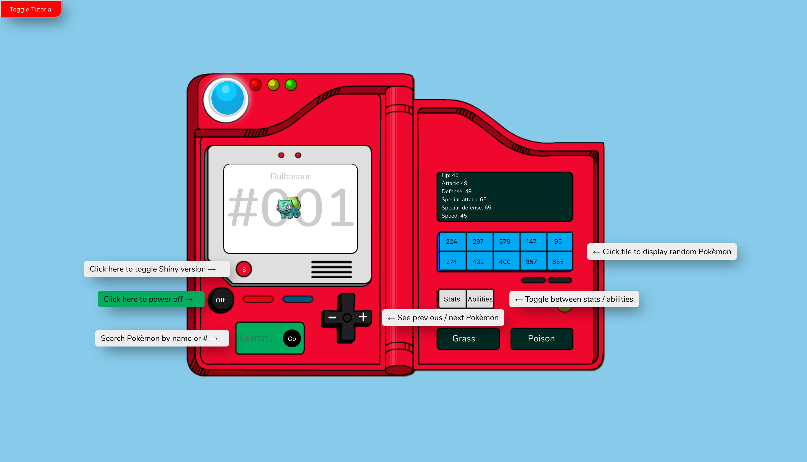
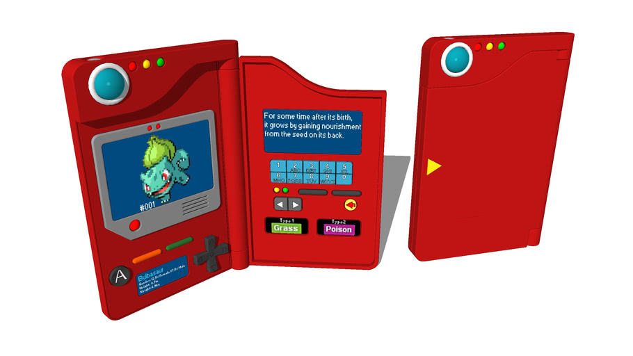

# Process

My intention from the beginning of this project was to build something a bit simpler than my previous projects and use some of the newer features of React that I haven't touched on too much, such as `hooks`, `context` and `React testing-library`.  
In the beginning I set up Redux, I had my actions/store etc set up, I soon found this to be overkill for a single page application with no other features other than fetching from a single API. Considering this I removed Redux from the application and used the useEffect hook to achieve basically the same thing.  
Nearing the initial end of the application, I began writing some tests and found it near impossible to achieve accurate tests due to me somewhat disregarding the purpose of React by not sectioning my app enough, back to the drawing board I split my application into as many small chunks as I could, introducing myself to context, the useContext hook and how to share my hooks throughout the application using a provider.  
I was now able to write some successful tests using React testing-library. I did my best to test each components functionality as I would expect it to work, which helped me understand context better along the way as well as the library. I then switched to `Cypress` to complete some end to end tests across the entire application, although I did section up the tests a little different than I normally would using Cypress since this only a way page application. I for sure still feel like I have a lot to learn in both libraries but this was a good starting point.  
I finalized my app hosting using `Firebase`, a service that I had not previously attempted to host with, so another good learning opportunity under my belt for the future! I actually found Firebase to potentially be the easiest hosting setup that I have tried out so far.

# Hosted Link

[Pokèdex](https://pokedex-f290d.web.app)

# Tutorial Mode

# API

[Pokèmon API](https://pokeapi.co/docs/v2)

# Command Line

- npm start | runs application
- npm test | runs React testing-library
- npm run cypress open | runs cypress end to end tests
- npm run compile:sass | compiles css file

# Tech

- React
- React Hooks
- Node-sass
- React-testing-library
- Axios
- Firebase (Hosting)

# Pokèdex Example

